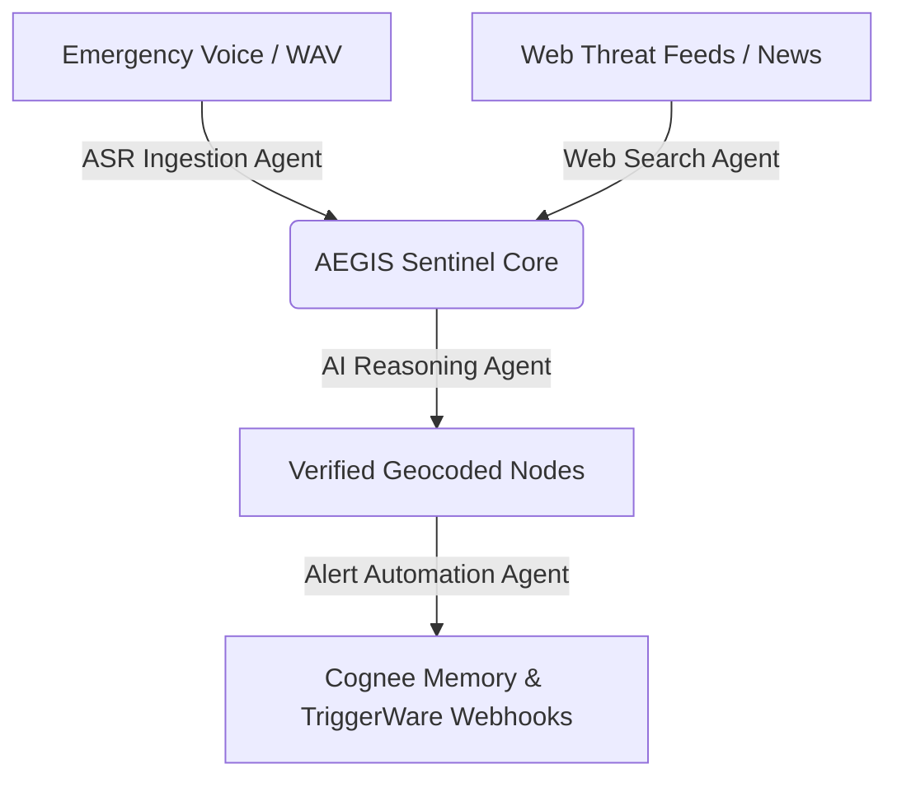

# 🛡️ AEGIS Sentinel: Multi-Agent Emergency Intelligence Terminal

**AEGIS Sentinel** (Agentic Emergency Geocoded Intelligence Sentinel) is a premium, real-time crisis coordination and spatial tracking dashboard. The system ingests emergency dispatcher voice audio feeds, verifies regional hazards using live web intelligence, extracts spatial coordinates using generative reasoning, commits verified states to graph memory, and triggers automated emergency response pipelines.

Built with a gorgeous glassmorphic design system, interactive Leaflet mapping, acoustic SOS beacons, synthesized speech warnings, and walkie-talkie signal simulation, AEGIS Sentinel represents the state-of-the-art in emergency coordination HUDs.

---

## 📡 Dynamic Multi-Agent Architecture

AEGIS Sentinel leverages 4 specialized agentic workflows operating in parallel:



1. **🎙️ ASR Ingestion Agent (Speechmatics)**: Ingests live dispatcher audio, slicing through heavy background crisis noise using Speechmatics' Enhanced ASR to produce clean text transcripts.
2. **🌐 Web Search Agent (Bright Data SERP)**: Executes targeted real-time web searches on Google SERP to cross-reference coordinates, weather warnings, and local reports.
3. **🧠 AI Reasoning Agent (Gemini 3.5)**: Performs dialectic reasoning to filter rumors, confirm eyewitness updates, compute latitude/longitude, and compile actionable safety precautions.
4. **⚙️ Alert Automation Agent (Cognee & TriggerWare)**: Commits verified hazard coordinates to Cognee's persistent semantic graph memory database and dispatches custom webhook triggers.

---

## 🚀 Key Features

* **📍 Geocentric Localization ("Localize" Pipeline)**: Centers the dark-mode spatial display on the user's location via the browser geolocation API, queries OpenStreetMap Nominatim to resolve their municipality, and auto-triggers a regional SERP intelligence scan.
* **🧭 Proximity-Constrained Evacuation Routing**: Safely routes users away from disaster zones. If standard shelter coordinates are too distant (>50 km), the system dynamically calculates a local safe sector and projects a virtual muster point 1.2 to 2 km away, rendering a neon escape path on the dark map.
* **📢 Synthesized Walkie-Talkie Speech Warnings**: Broadcasts critical warnings using browser speech synthesis, complete with simulated radio start-chirps, vocalized precautions, and trailing walkie-talkie static squelches.
* **🔊 Acoustic SOS Beacon**: Generates alternating frequency distress siren patterns using the browser's native Web Audio API oscillators to assist search-and-rescue teams.

---

## 📦 Preparing & Deploying to Hugging Face Spaces

This application is fully optimized for **Hugging Face Spaces** using the **Docker SDK**. Follow these steps to deploy your own instance.

### 🔑 Step 1: Gather API Credentials
Ensure you have the following API credentials active. These will be added as secrets to your Hugging Face Space:

1. **`AIML_API_KEY`** *(Required)*: Used for Gemini 3.5 extraction and verification.
2. **`SPEECHMATICS_API_KEY`** *(Required)*: Used for Speechmatics batch and streaming ASR.
3. **`BRIGHT_DATA_API_TOKEN`** *(Optional)*: Used to discover active SERP zones and scrape Google live context. (If not configured, the terminal seamlessly utilizes fallback datasets).

---

### 🛠️ Step 2: Create the Space on Hugging Face
1. Go to your [Hugging Face Spaces Profile](https://huggingface.co/spaces).
2. Click **Create new Space**.
3. Name your space (e.g., `aegis-sentinel-terminal`).
4. Select **Docker** as the SDK.
5. Choose **Blank** (or any clean Docker template) and set the visibility (Public/Private).
6. Click **Create Space**.

---

### 🔒 Step 3: Add Variables and Secrets
Before uploading the code, configure the environment variables:
1. In your Space's tab, click on **Settings** (near the top right).
2. Scroll down to the **Variables and secrets** section.
3. Under **Repository secrets**, click **New secret** and add:
   * Name: `AIML_API_KEY` | Value: *[Your API Key]*
   * Name: `SPEECHMATICS_API_KEY` | Value: *[Your API Key]*
   * Name: `BRIGHT_DATA_API_TOKEN` | Value: *[Your Token]*
4. Keep the variables list clean (the container automatically listens on port `7860` mapped via metadata).

---

### 💻 Step 4: Deploy the Code
You can push the repository to Hugging Face via Git or upload files directly.

#### Option A: Deployment via Git CLI
From your local terminal, run the following commands (replace `your-username` and `space-name` with your actual Hugging Face details):

```bash
# Add Hugging Face Space as a remote destination
git remote add hf https://huggingface.co/spaces/your-username/space-name

# Force track and stage all code assets including metadata
git add .
git commit -m "Configure Dockerfile and README metadata for HF Spaces"

# Push the code to the Hugging Face main branch
git push -f hf main
```

#### Option B: Deployment via Hugging Face Web GUI
1. Navigate to the **Files and versions** tab of your Space.
2. Drag and drop all project files (including the updated `Dockerfile`, `requirements.txt`, `web/`, and `web_server.py`) directly into the browser.
3. Commit the changes. The Hugging Face container registry will automatically trigger the build pipeline.

---

## 🐳 Local Docker Development & Testing

To test the container environment locally exactly as it executes on Hugging Face:

```bash
# 1. Build the Docker image
docker build -t aegis-sentinel .

# 2. Run the container locally (passing environment variables from your local shell or .env)
docker run -p 7860:7860 --env-file .env aegis-sentinel
```

Once running, open your web browser and navigate to `http://localhost:7860` to access the AEGIS HUD.

---

## 🏗️ Technical Stack Details

* **Backend Engine**: Pure Python 3.10 standard HTTP `socketserver` architecture optimized for lightweight low-latency routing without heavy external ASGI dependencies.
* **Frontend HUD**: Vanilla HTML5, premium vanilla CSS3 variables system (glassmorphism overlays, glowing box-shadows, animations, modern typography Outfit/Inter), and interactive reactive vanilla JavaScript.
* **GIS Mapping System**: Leaflet API (configured with customized Stadia Maps Alidade Smooth Dark tile layers for visual continuity with the dark HUD).
* **Audio Synthesis**: Native Browser Web Audio API & Speech Synthesis API.
