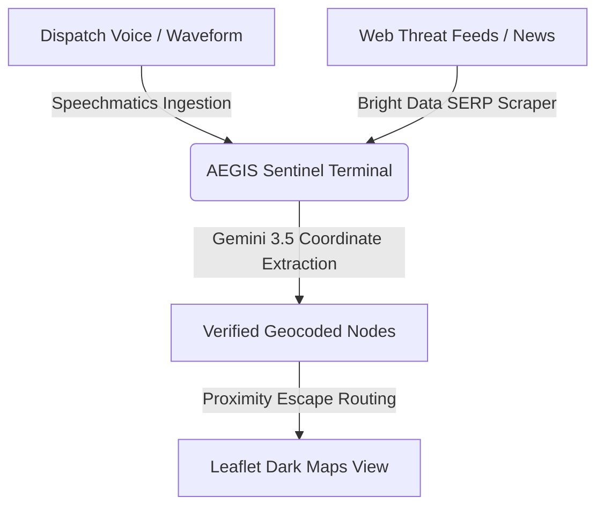
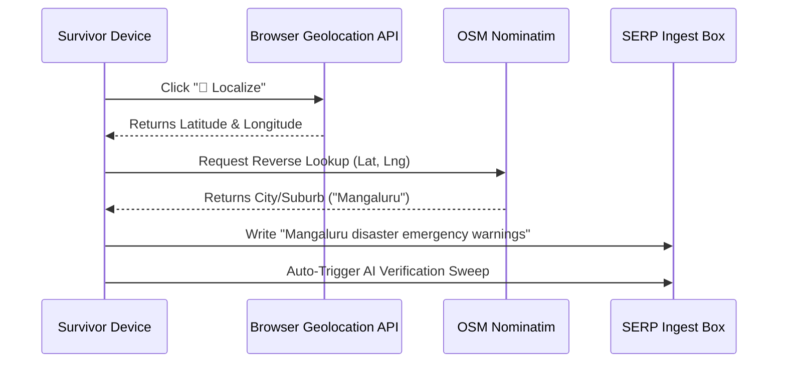
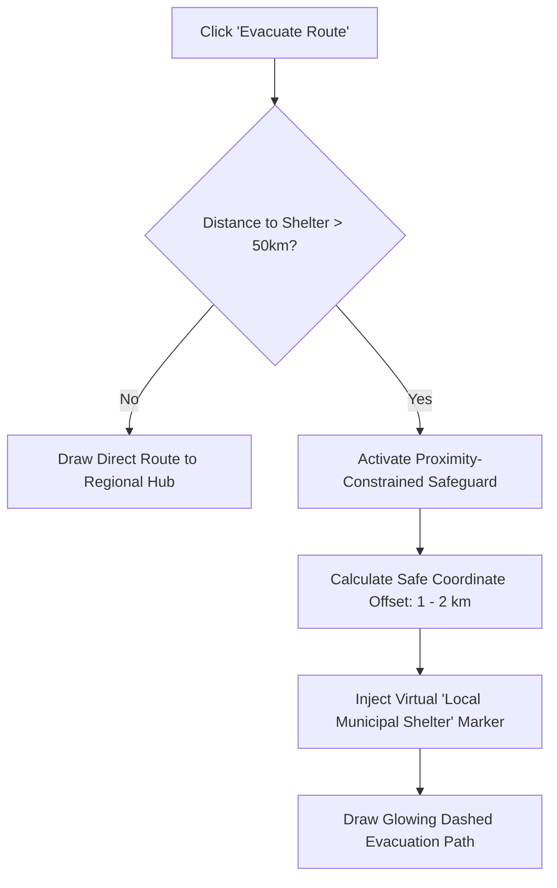
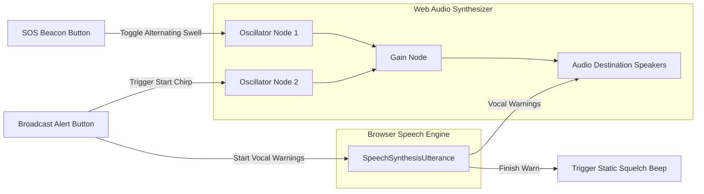

# 🖥️ Workflows & Architecture Presentation: AEGIS Sentinel

This slide deck covers the entire technical architecture, data pipelines, and spatial workflows of **AEGIS Sentinel** (Agentic Emergency Geocoded Intelligence Sentinel).

* **Format**: 5 high-impact slides of diagrams and flows, transitioning directly to a **Live Website Demonstration**.

---

## 🛝 Slide 1: Strategic Project Overview & Rebranding
### 📝 Slide Content
* **Title**: **AEGIS SENTINEL**
* **Subtitle**: *The Multi-Agent Emergency Coordination & Intelligence Terminal*
* **Core Mission**: To bridge the gap between emergency audio broadcasts, web intelligence, and immediate spatial survival routing.
* **The Clean Rebrand**:
  * 🛡️ Deployed a custom premium glassmorphic visual system branded **AEGIS**.
  * 🔏 Completely purged legacy search engine references (e.g. MSN) globally.
  * 📡 Rebranded general updates to **Sentinel Alerts & Insights** and **Atmospheric Telemetry**.

### 📊 System Context Flow


---

## 🛝 Slide 2: Collaborative Multi-Agent Architecture
### 📝 Slide Content
* **Title**: **Multi-Agent Operations HUD**
* **Concept**: Parallel, state-coordinated intelligence pipelines.
* **The 4 AI Agents**:
  1. **🎙️ ASR Ingestion Agent**: Processes emergency transcripts via mock or live Speechmatics audio files.
  2. **🌐 Web Search Agent**: Searches real-world hazards, cyclone tracks, and landslide locations using Bright Data's SERP API.
  3. **🧠 AI Reasoning Agent**: Dialectically filters rumors, validates geocoded nodes, and issues verification ratings.
  4. **⚙️ Alert Automation Agent**: Commits hazard nodes to Cognee Graph Memory databases and triggers TriggerWare custom Slack webhooks.

### 📊 Agent Interaction Timeline
```
[Pipeline Start]
       │
       ▼ (Agent ASR Ingest)   ──► Pulsing Indicator -> "ASR stream parsing..."
       │
       ▼ (Agent Web Search)   ──► Scrapes Bright Data -> "Verifying regional reports..."
       │
       ▼ (Agent AI Reasoner)  ──► Gemini 3.5 Verification Score -> "Filtering noise..."
       │
       ▼ (Agent Alert Exec)   ──► Graph database write & webhooks sandbox post
       │
[Pipeline Standby]
```

---

## 🛝 Slide 3: Real-Time Ingestion & Geocentric Localization
### 📝 Slide Content
* **Title**: **Geocentric Scanning & Localization Workflows**
* **The Localize Button Pipeline**: Instantly shifts coordinates from a global view to the survivor's immediate location.
* **Technical Ingestion Sequence**:
  1. **Coordinate Retrieval**: Queries browser-native `navigator.geolocation` API.
  2. **Interactive Markers**: Centers Leaflet dark map and anchors a pulsing blue user location marker.
  3. **Reverse Geocoding**: Queries OpenStreetMap Nominatim reverse directory to resolve exact city or suburb name.
  4. **Dynamic Query Generation**: Generates targeted keywords (e.g., `"flood warnings Mumbai"` or `"cyclone threats Chennai"`) and auto-triggers a live SERP pipeline run.

### 📊 Ingestion Workflow


---

## 🛝 Slide 4: Safe Proximity Evacuation Workflows
### 📝 Slide Content
* **Title**: **Proximity-Constrained Safe Evacuation Routing**
* **The Safe Haven Dilemma**: Standard evacuation lines map cross-country paths (e.g. Guwahati landslide routing to Chennai bases) which are physically impossible.
* **Proximity Safeguard Algorithm**:
  1. **Geodesic Assessment**: Compute geodesic distance (in degrees) to nearest preset regional shelter.
  2. **Threshold Trigger**: If geodesic vector is greater than **50 kilometers**, activate Proximity Safe muster points.
  3. **Virtual Shelter Projector**: Project a virtual Safe muster node offset by exactly **1.2 to 2 kilometers** in a safe sector.
  4. **Escape Path Render**: Plot the local safe marker on Leaflet and draw a glowing, dashed neon-green escape flowline.

### 📊 Evacuation Routing Flow


---

## 🛝 Slide 5: Acoustic SOS Beacon & Speech warnings
### 📝 Slide Content
* **Title**: **Acoustic SOS Beacon & Speech warning Workflows**
* **SOS Siren Beacon**: Alternates audio frequency oscillators (Web Audio API) between high and low frequencies (sweep gains) for search-and-rescue assistance.
* **Synthesized TTS Warnings**: Generates automated SpeechSynthesis warnings to regional devices.
* **Walkie-Talkie Audio Sweep Logic**:
  * **Opening beep**: Web Audio oscillator sweeps digital beeps to indicate transmission start.
  * **Speech warn**: Text-To-Speech warns coordinates and Gemini-compiled guidelines.
  * **Closing squelch**: Oscillators synthesis walkie-talkie white-noise static squelches.

### 📊 Acoustic Audio Pipelines


---

## 🛝 Transition: Live Website Demonstration
### 📝 Live Demo Step-by-Step Instructions
* *Presenters can transition directly to the live terminal at `http://localhost:8000`:*
1. **Show Multi-Agent HUD**: Trigger the simulated pipeline. Point out the glowing agent avatars lighting up sequentially as the thoughts box prints active reasoning logs.
2. **Demonstrate 📍 Localize**: Click `📍 Localize`. Point to the pulsing blue location marker and the Nominatim resolved city name on the search bar.
3. **Demonstrate Proximity Evacuation**: Locate a hazard card, click `🧭 Evacuate Route`, and show how the map automatically injects a **Local Municipal Shelter** 1.5 km away, plotting a beautiful neon green dashed path.
4. **Demonstrate Walkie-Talkie Speech Alerts**: Click `📢 Broadcast Alert` on a verified card. Hear the walkie-talkie start-chirps, the vocalized alert description, and the closing static squelch!
5. **Explore Prognosis and Settings**: Click `See full prognosis` to show the glassmorphic 5-day modal bars, and open the Settings modal to demonstrate base map styling and live volume adjustments in real-time.
